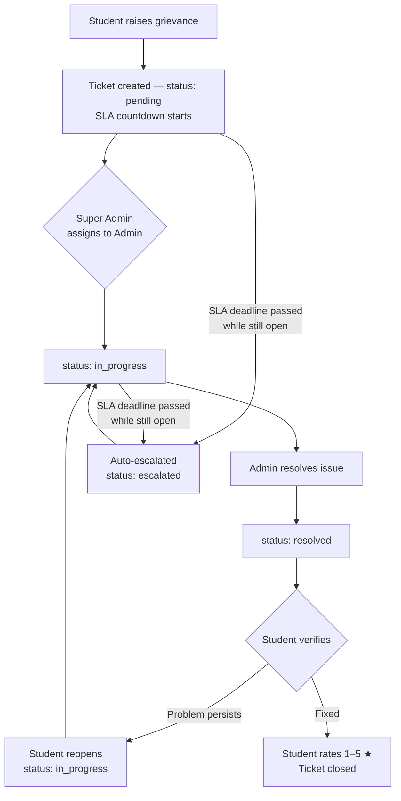
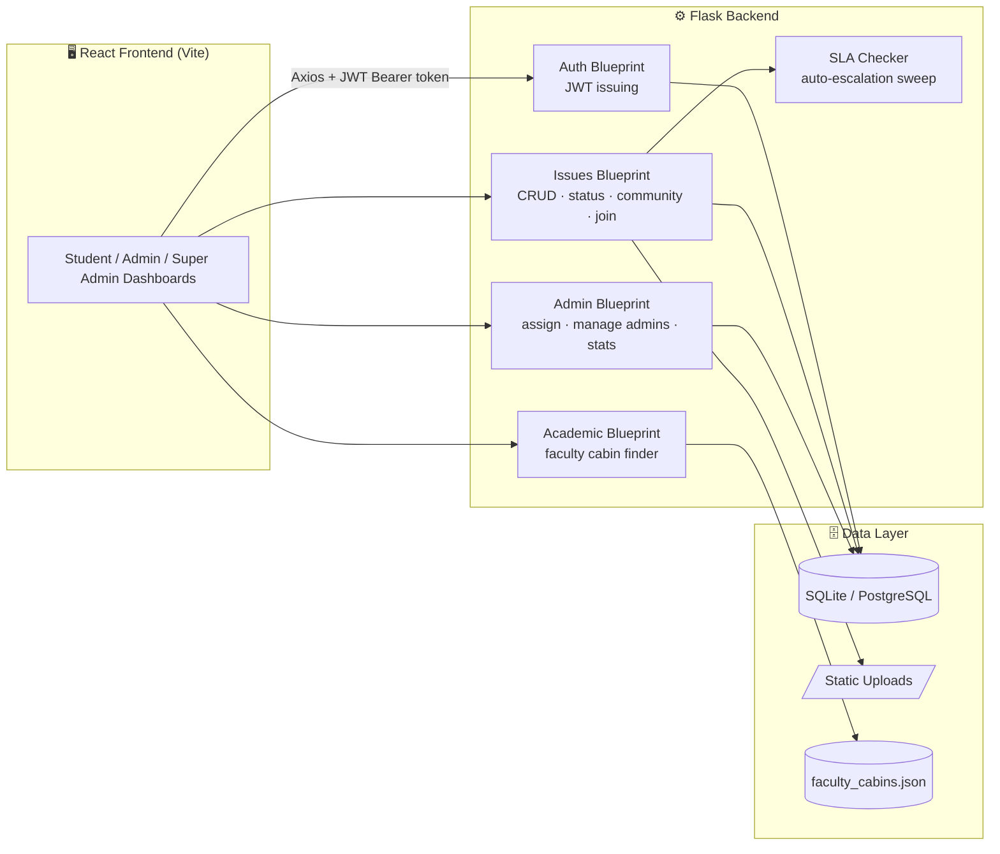

# 🔧 FIXora
### *— sorted, not ignored*

**A campus grievance redressal & maintenance tracking system**
built to fix the one thing every college complaint system lacks: **accountability**.

Made for **Summer of CodeFest 2.O — 2026** · Team **Code Quest**

---

## 📌 Table of Contents

1. [The Problem](#-the-problem)
2. [Our Solution](#-our-solution)
3. [Key Features](#-key-features)
4. [Roles & Permissions](#-roles--permissions)
5. [Grievance Lifecycle](#-grievance-lifecycle)
6. [SLA & Auto-Escalation](#-sla--auto-escalation)
7. [Tech Stack](#-tech-stack)
8. [System Architecture](#-system-architecture)
9. [Project Structure](#-project-structure)
10. [Getting Started (Local Setup)](#-getting-started-local-setup)
11. [Environment Variables](#-environment-variables)
12. [Default Login Credentials](#-default-login-credentials)
13. [API Reference](#-api-reference)
14. [Screenshots](#-screenshots)
15. [Deployment](#-deployment)
16. [Future Scope](#-future-scope)
17. [Team](#-team)
18. [License](#-license)

---

## 🚩 The Problem

On most campuses, complaints like a broken fan, a leaking pipe, faulty Wi-Fi, or a
flickering tube light are reported informally — through WhatsApp groups, word of
mouth, or a quick email to the wrong department. These reports routinely:

- Have **no centralized record** — nobody can point to "the" list of open issues
- Have **no clear owner** — it's unclear which department or person is responsible
- Have **no progress tracking** — the student has no idea if anyone even saw it
- Have **no response timeline** — "we'll look into it" could mean a day or a month
- Have **no accountability** — nothing stops an issue from quietly disappearing

The result: students lose trust in the system, small maintenance issues turn into
safety hazards, and departments have no data to show where they're actually
falling behind.

## 💡 Our Solution

**FIXora** is a full-stack web platform that gives every grievance a visible,
trackable life — from the moment it's raised to the moment it's closed:

- Every issue gets a **ticket** with a category, an owner, and an SLA countdown
- Students get a **live status trail** instead of radio silence
- Admins only see the queries that belong to **their** block/department
- A **Super Admin** has full visibility and routes each query to the right desk
- Issues that blow past their deadline **auto-escalate** — no one has to remember
- Duplicate reports collapse into one tracked ticket via the **Community Board**

---

## ✨ Key Features

### 👨‍🎓 For Students
| Feature | Description |
|---|---|
| 🔐 Secure Auth | Register/login with a canvas-based CAPTCHA (with audio playback for accessibility) protecting the form |
| 📝 Raise a Grievance | Title, description, category (Health / Maintenance / Academic / Personal), block type (Hostel / Academic Block / LC / AR), block number, and an optional file/image attachment |
| 🎫 My Grievances | Card-based view of every issue raised, with live status badge + SLA badge |
| 🪜 Progress Stepper | Visual step tracker: **Submitted → Assigned → In Progress → Resolved**, including an "Escalated" state |
| 🔁 Reopen | If a "resolved" issue isn't actually fixed, the student can reopen it with a reason — it goes back to `in_progress` |
| ⭐ Feedback & Rating | Rate a resolved issue 1–5 stars with optional comments, logged into the issue's history |
| 🧩 Community Board | See open issues already reported by *other* students for the same block/category and hit **"I have this too"** instead of filing a duplicate — backed reports show a live supporter count |
| 🏫 Academic Cabin Finder | Search faculty cabins by name, cabin number, block, or availability status; pin your proctor for quick access; copy cabin number / phone in one click |
| 🌗 Light/Dark Theme | Full theme toggle, persisted across sessions |

### 🛠️ For Admins (one per block/department)
| Feature | Description |
|---|---|
| 📋 Scoped Queue | Only sees grievances routed to their block by the Super Admin |
| 🔄 Status Updates | Move an assigned issue through `pending → in_progress → resolved` with a remark |
| ⏱️ SLA Visibility | Every row shows the live SLA countdown / overdue badge |
| 📊 Dashboard Stats | Recharts-powered breakdown of pending / in-progress / resolved / escalated counts |

### 👑 For the Super Admin
| Feature | Description |
|---|---|
| 🌍 Full Visibility | Sees every grievance across every block, unfiltered |
| 🧭 Assignment Console | Assigns each raised query to the correct admin (dropdown limited to admins of that query's block) |
| 👥 Admin Management | Creates new admin accounts and scopes each to exactly one block |
| 🚨 Escalation View | Dedicated view of every overdue/escalated ticket, sorted by how overdue it is |
| 📈 Org-Wide Reports | Aggregate stats and category/block breakdown for the whole campus |

> Super Admin accounts are **never self-registered** — they're seeded automatically
> on server startup so the platform is always usable out of the box (see
> [Default Login Credentials](#-default-login-credentials)).

---

## 🔐 Roles & Permissions

| Capability | Student | Admin | Super Admin |
|---|:---:|:---:|:---:|
| Register via public form | ✅ | ✅ (must pick a block) | ❌ (seeded only) |
| Raise a grievance | ✅ | ❌ | ❌ |
| View own grievances | ✅ | — | — |
| View all grievances | ❌ | ❌ (only assigned-to-block) | ✅ |
| Update issue status | ❌ | ✅ (only if assigned) | ✅ |
| Assign issue to an admin | ❌ | ❌ | ✅ |
| Create admin accounts | ❌ | ❌ | ✅ |
| View escalated issues | ❌ | ✅ | ✅ |
| See Community Board / join issues | ✅ | — | — |
| Reopen a resolved issue | ✅ (own only) | — | — |
| Rate a resolved issue | ✅ (own only) | — | — |

---

## 🔄 Grievance Lifecycle



---

## ⏱️ SLA & Auto-Escalation

- Every issue is stamped with an `sla_deadline` at creation time, based on the
  configurable `SLA_HOURS` window (default: **24 hours**).
- Every meaningful read (`GET /issues`, `/issues/<id>`, `/issues/escalated`,
  `/stats`) runs a live sweep that flips any `pending`/`in_progress` issue past
  its deadline to `escalated` — so the dashboard is always accurate without a
  background cron job.
- Escalated issues are surfaced to Admins and the Super Admin in a dedicated,
  sorted-by-most-overdue view, so nothing quietly falls through the cracks.
- This is what lets FIXora treat a **flickering bulb** and a **safety hazard**
  differently: both get a clock, but only one of them is designed to blow past
  it fast enough to demand attention.

---

## 🧰 Tech Stack

**Frontend**
- React 19 (Vite)
- Axios (API client with JWT auto-attach interceptor)
- Recharts (dashboard charts)
- React Context API (Auth + Theme state)
- Custom CSS — hand-built light/dark "corkboard" design system (no UI framework)
- HTML5 Canvas (custom CAPTCHA renderer)

**Backend**
- Flask (Python)
- Flask-SQLAlchemy (ORM)
- Flask-JWT-Extended (stateless JWT auth, role claims)
- Flask-CORS
- Werkzeug (password hashing)
- python-dotenv
- Gunicorn (production WSGI server)

**Database**
- SQLite (local development)
- PostgreSQL-ready (`DATABASE_URL` env var auto-normalizes `postgres://` → `postgresql://` for Render/Heroku-style URLs)

**Architecture**
- Monolithic deployment — Flask serves the built React app as static files, and
  the REST API, from a single process
- RESTful API design with JWT Bearer auth
- Role-Based Access Control (Student / Admin / Super Admin)

---

## 🏗️ System Architecture



---

## 📁 Project Structure

```
Fixora/
├── backend/
│   ├── app.py                    # App factory, blueprint registration, superadmin seeding
│   ├── config.py                 # Env-driven config (DB URL, JWT, SLA hours, uploads)
│   ├── seed_superadmin.py        # Manually (re)create the Super Admin account
│   ├── requirements.txt
│   ├── .env.example
│   ├── models/
│   │   ├── user.py                # Student / Admin / Super Admin
│   │   ├── issue.py                # Core grievance model + supporters_count
│   │   ├── issue_join.py           # "I have this too" join table
│   │   └── status_log.py           # Full audit trail per issue
│   ├── routes/
│   │   ├── auth_routes.py          # /register, /login
│   │   ├── issue_routes.py         # create/list/detail/status/reopen/feedback/community/join
│   │   ├── admin_routes.py         # assign, admins CRUD, staff, blocks, stats, escalated
│   │   └── academic_routes.py      # /academic/cabins, /academic/stats
│   ├── utils/
│   │   ├── auth_helper.py          # @role_required decorator
│   │   ├── file_upload.py          # attachment validation & saving
│   │   └── sla_checker.py          # live auto-escalation sweep
│   ├── static/uploads/             # student-submitted attachments
│   └── database/
│       ├── app.db                  # SQLite database (auto-created)
│       └── faculty_cabins.json     # seed data for the Cabin Finder
│
└── frontend/
    ├── index.html
    ├── vite.config.js
    ├── package.json
    └── src/
        ├── main.jsx
        ├── App.jsx                          # Role-based dashboard switch
        ├── index.css                        # Full design system (light + dark)
        ├── api/axiosInstance.js             # Axios instance + JWT interceptor
        ├── context/
        │   ├── AuthContext.jsx
        │   └── ThemeContext.jsx
        ├── components/
        │   ├── Captcha.jsx                  # Canvas CAPTCHA w/ audio playback
        │   ├── DoodleBackground.jsx
        │   ├── StatusBadge.jsx
        │   ├── SLABadge.jsx
        │   ├── StatsChart.jsx               # Recharts wrapper
        │   ├── GrievanceProgressStepper.jsx # Stepper + reopen + rating
        │   └── AcademicCabinFinder.jsx      # Faculty cabin search & pinning
        ├── data/facultyCabins.js
        └── pages/
            ├── AuthPage.jsx
            ├── StudentDashboard.jsx          # Raise issue + My Issues + Community Board
            ├── AdminDashboard.jsx
            └── SuperAdminDashboard.jsx       # Assignment console + admin management
```

---

## 🚀 Getting Started (Local Setup)

### Prerequisites
- Python 3.10+
- Node.js 18+ and npm
- Git

### 1. Clone & enter the project
```bash
git clone <your-repo-url>
cd Fixora
```

### 2. Backend setup (Terminal 1)
```bash
cd backend
python -m venv venv

# Activate the virtual environment:
source venv/bin/activate        # macOS / Linux
venv\Scripts\activate           # Windows (Command Prompt / PowerShell)
source venv/Scripts/activate    # Windows (Git Bash)

pip install -r requirements.txt

cp .env.example .env            # macOS/Linux — use `copy .env.example .env` on Windows CMD

python app.py
```
Backend runs at **http://localhost:5000**
Health check: `GET http://localhost:5000/api/health`

### 3. Frontend setup (Terminal 2)
```bash
cd frontend
npm install
npm run dev
```
Frontend runs at **http://localhost:5173** and proxies all `/api/*` calls to
the Flask server on port 5000 — no manual CORS config needed for local dev.

### 4. Open the app
Visit **http://localhost:5173**, register a Student account, or log in as the
seeded Super Admin (see [below](#-default-login-credentials)) to create Admin
accounts for each block.

---

## 🔑 Environment Variables

Configured in `backend/.env` (copy from `.env.example`):

| Variable | Purpose | Default |
|---|---|---|
| `SECRET_KEY` | Flask session/signing secret | `dev-secret-key-change-this` |
| `JWT_SECRET_KEY` | Secret used to sign JWTs | `dev-jwt-secret-change-this` |
| `DATABASE_URL` | DB connection string (SQLite by default, Postgres-ready) | local SQLite file |
| `SLA_HOURS` | Hours before an open issue auto-escalates | `24` |
| `SUPERADMIN_NAME` | Display name for the seeded Super Admin | `Super Admin` |
| `SUPERADMIN_EMAIL` | Login email for the seeded Super Admin | `superadmin@fixora.edu` |
| `SUPERADMIN_PASSWORD` | Login password for the seeded Super Admin | `ChangeMe@123` |

> ⚠️ The defaults are fine for a local demo. **Change every secret before
> deploying anywhere real.**

---

## 👤 Default Login Credentials

A Super Admin account is **auto-seeded** the first time the backend starts —
no manual setup required:

| Role | Email | Password |
|---|---|---|
| Super Admin | `superadmin@fixora.edu` | `ChangeMe@123` |

From there:
1. Log in as Super Admin → **Admins** tab → create one Admin per block
   (`Health`, `Maintenance`, `Academic`, `Personal`)
2. Register Student accounts from the public sign-up form
3. Raise a grievance as a student, then assign / resolve it as Super Admin / Admin

Need to reset or recreate the Super Admin manually?
```bash
python backend/seed_superadmin.py
```

---

## 📡 API Reference

Base URL: `http://localhost:5000/api`
All routes except `/register`, `/login`, and `/health` require an
`Authorization: Bearer <access_token>` header.

### Auth
| Method | Route | Access | Description |
|---|---|---|---|
| POST | `/register` | Public | Register a Student or Admin (Admin must include `department`) |
| POST | `/login` | Public | Returns JWT `access_token` + user profile |

### Issues
| Method | Route | Access | Description |
|---|---|---|---|
| POST | `/issues` | Student | Create a grievance (JSON or multipart with `attachment`) |
| GET | `/issues` | Student / Admin / Super Admin | List issues (own for student, all for admin/superadmin). Filters: `status`, `category`, `location_type`, `block_no` |
| GET | `/issues/community` | Student | Cross-student feed of open issues to back instead of duplicating |
| POST | `/issues/<id>/join` | Student | "I have this too" — backs an existing issue |
| GET | `/issues/<id>` | Owner / Admin / Super Admin | Full issue detail + status log history |
| PUT | `/issues/<id>/status` | Admin (if assigned) / Super Admin | Update status with a remark |
| POST | `/issues/<id>/reopen` | Student (own only) | Reopen a resolved issue that isn't actually fixed |
| POST | `/issues/<id>/feedback` | Student (own only) | Submit a 1–5 star rating + comment |
| GET | `/stats` | Any authenticated user | Status/category counts scoped to role |

### Admin & Super Admin
| Method | Route | Access | Description |
|---|---|---|---|
| PUT | `/issues/<id>/assign` | Super Admin only | Route a query to a specific Admin |
| GET | `/issues/escalated` | Admin / Super Admin | All overdue issues, most-overdue first |
| GET | `/staff` | Admin / Super Admin | List staff, optional `?department=` filter |
| GET | `/admins` | Super Admin only | List every Admin account with open-issue counts |
| POST | `/admins` | Super Admin only | Create a new Admin scoped to one block |
| GET | `/blocks` | Any authenticated user | The 4 valid grievance blocks, for dropdowns |

### Academic / Cabin Finder
| Method | Route | Access | Description |
|---|---|---|---|
| GET | `/academic/cabins` | Public | Search faculty cabins by name/number/phone/location, filter by block/status |
| GET | `/academic/stats` | Public | Occupied / vacant / allotted / handover-pending counts |

**Sample: Register → Login → Create Issue (cURL)**

```bash
curl -X POST http://localhost:5000/api/register \
  -H "Content-Type: application/json" \
  -d '{"name":"Aman","email":"aman@vitbhopal.ac.in","password":"test123","role":"student"}'

curl -X POST http://localhost:5000/api/login \
  -H "Content-Type: application/json" \
  -d '{"email":"aman@vitbhopal.ac.in","password":"test123"}'

# Copy access_token from the login response, then:
curl -X POST http://localhost:5000/api/issues \
  -H "Authorization: Bearer <token>" \
  -H "Content-Type: application/json" \
  -d '{"title":"Fan not working","description":"Hostel A room 204 fan broken","category":"Maintenance","location_type":"Hostel","block_no":"A"}'
```

---

## 📸 Screenshots

> Add your captured screenshots here before the presentation — the sections
> below give a suggested order that matches a typical demo flow.

| Screen | Description |
|---|---|
| Auth Page | CAPTCHA-protected login/register with role selection |
| Student Dashboard | Raise-a-grievance form + "My Grievances" cards |
| Community Board | Collective problems others already reported, with "I have this too" |
| Academic Cabin Finder | Faculty cabin search, pinning, and location guide |
| Grievance Progress Stepper | Submitted → Assigned → In Progress → Resolved, with reopen & rating |
| Admin Dashboard | Scoped queue, status updates, SLA badges, charts |
| Super Admin Dashboard | Org-wide queries, assignment console, admin management |

---

## ☁️ Deployment

Deployed as a single Render web service (free tier), auto-deployed from GitHub:

1. `frontend` is built (`npm run build`) and its output served as static files
   by the Flask app (`app.py` → `send_from_directory`)
2. Flask serves both the SPA and the `/api/*` REST endpoints from one process —
   no separate frontend hosting or CORS proxy needed in production
3. `DATABASE_URL` can point at a managed Postgres instance; the app
   auto-normalizes Render's `postgres://` prefix to SQLAlchemy's expected
   `postgresql://`

To build for production locally:
```bash
cd frontend && npm run build
# copy/point frontend/dist into backend's static_folder, then:
cd ../backend && gunicorn app:app
```

---

## 🔭 Future Scope

- 🤖 AI-based complaint prioritization & auto-categorization
- 📱 Dedicated mobile application (iOS/Android)
- 📷 QR-code based complaint reporting (scan a code in a hostel room/lab to pre-fill location)
- ✉️ Email & SMS notifications on status changes and escalations
- 📊 Predictive maintenance analytics (recurring-issue detection by location)
- 🌐 Multi-language support for a wider student base
- 🔔 In-app push notifications
- 🗂️ Bulk admin actions and CSV export for institutional reporting

---

## 👥 Team


---

## 📄 License

This project was built for Project exihibition
submission. No formal license has been applied; please reach out to the team
before reusing this code commercially.

---

**FIXora** — because a complaint that disappears is worse than no complaint at all.
